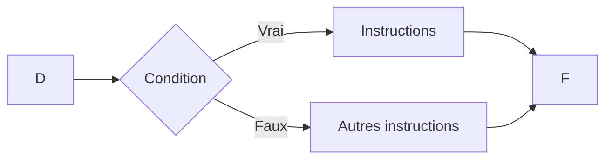

# Apprendre la Programmation avec le langage C

# Motivation
Dans ce cours, nous n'avons pas pour ambition d'être exhaustif. Notre ambition est de démontrer par la pratique ce que vous pouvez accomplir lorsque vous maîtrisez les bases de la programmation. Comme exemple, nous allons beaucoup pratiquer et acquérir des connaissances qui vous permettront de vous débrouiller dans les petits comme les grands projets.

Notre approche ayant été comprise, à l'issue de ce cours, vous serez en mesure de programmer en quelques minutes:

* une simple calculatrice
* une application pour dire bonjour
* un convertisseur de devises
* un jeu de devinette (2 ways) (avec et sans triche)

Et de résoudre des défis.
Nous comptons mettre en place pour le dernier jour de formation, 3 défis au cours desquels vous avez la possibilité de mettre vous-même en pratique les connaissances que vous aurez apprises.
Attention, les défis ne se limiterons pas qu'aux seules notions qu'on aura apprises.
Cependant, avec un petit peu de logique et de perspicacité mais aussi d'originalité, vous y parviendrez pour sûr !

En espérant que ces raisons vous motivent assez, rendez-vous à la prochaine section où nous lirons pourquoi vous avez besoin d'comprendre le langage C.

# Pourquoi apprendre le langage C ?
Le langage C est un langage bas niveau comparé à beaucoup d'autres langages. 
Bas niveau signifie que c'est un langage très proche du niveau des composants électroniques.
L'avantage de ça c'est que vous avez un accès à des techniques qui peuvent vous permettre d'optimiser l'utilisation de la mémoire.
Nous parlerons de la mémoire de la machine à temps voulu mais pour l'instant, retenons juste que le langage C est un bon début pour mieux appréhender le fonctionnement de la mémoire aussi son fonctionnement. D'un autre côté, il vous permet très vite de prendre les bonnes habitudes car en programmation ce n'est pas toujours celui qui code le plus qui code de mieux.

# Les bases
> Toute chose part de quelque part.

La programmation est un super pouvoir qui vous donne la capacité de donner vie à vos idées les plus incroyables. Il est vraiment interessant de jeter un coup d'oeil sur les réalisations technologiques qui ont été faites jusqu'ici, partant des mathématiques aux algorithmes jusqu'aux intelligences artificielles dont on parle beaucoup ces derniers jours.

Il s'agit d'un très vaste univers où la base réside à la compréhension du comment la machine fait pour prendre des instructions et les exécuter.

L'ordinateur est un assemblage de circuits électroniques où les informations circulent à l'état binaire. Il est une super calculatrice qui est en mesure d'exécuter des instructions élémentaires à une vitesse de plus de 3 milliars par secondes. C'est la grande révolution même si ça n'a pas toujours été le cas.

Avant la réalisation de n'importe quel programme informatique, il est très primordial de se poser un certain nombre de questions:

* Qu'est-ce qu'on me demande de faire ?
* Quelles seront les entrées de mon programme ?
* Quelles seront les sorties de mon programme ?
* Quelles étapes élementaires dois-je suivre pour partir des données d'entrée aux données de sortie ?
* Quels sont les outils que je dois utiliser ?
* etc.

Toutes ces questions bien avant d'avoir écrit n'importe quelle ligne de code. Mais cependant ces questions relèvent de la plus grande importante car les réponses-là vous permettront de mieux orienter les recherches (potentielles) que vous allez mener, les notions que vous allez aborder lors de la conception, etc.

Après maintenant vous vous posez pour réaliser comme dit tantôt les étapes élementaires qui doivent mener des données d'entrées aux données de sortie.

L'ensemble des étapes qui vous permettent de passer de l'entrée à la sortie sont appelées: **algorithme**.

> Pour reformuler, nous dirons qu'un **algorithme** est un ensemble d'étapes, d'instructions qui permettent de réaliser un objectif.

Exemple d'algorithme:

* Une recette de cuisine
* La valeur absolue
* L'algorithme de division euclidienne
* L'algorithme de tri à bulles
* etc.

Tous ces algorithmes ont un ensemble d'étapes qui une fois exécutées vous mênent un objectif.

Nous allons dans ce cours apprendre comment représenter un algorithme sous forme de pseudo-code, algorigramme et l'exécuter en langage C.
Pour une bonne compréhension, nous vous demandons donc d'avoir une installation minimale.

* Editeur de texte (obligatoire): pour saisir le code source de nos programmes en langage C.
* Compilateur (obligatoire): qui est en mesure de traduire le code source en code machine (binaire).
* Déboggeur (facultatif): qui permet de débogger notre code source afin de relever les erreurs.


Grâce à un Environnement de Développement Integré (Integrated Development Evironment: IDE), nous avons tous ces composants en un seul.
Nous allons donc télécharger et installer l'IDE Code::Blocks muni du compilateur du langage C afin de nous faciliter les tâches.

Attention à prendre le fichier qui contient mingw dans le nom car il est muni du compilateur.

> **Lien:** https://www.codeblocks.org/downloads/binaries/

## Un premier projet

Le premier projet que l'on va exécuter est d'afficher un message de bienvenue. En langage C on le peut le faire à l'aide de ce snippet:

```c
#include <stdio.h>
#include <stdlib.h>

int main(int argc, char* argv[]) 
{
    printf("Hello GDSC !\n");
    return 0;
}
```

Il y a quelques points à noter sur ce programme:
* Les deux premières lignes diaboliques obligatoires bizarres et qui font un excellent travail, on appelle **directives au préprocesseur**:
    ```c
    #include <stdio.h>
    #include <stdlib.h>
    ```
    
* La porte d'entrée d'un programme écrit en langage C est la fonction `main`. Autrement dit, pour que votre programme soit fonctionnel, vous devez avoir la fonction `main`:
    ```c
    int main(int argc, char* argv[])
    {
        // instructions
    }
    ```
* Une fonction est juste un ensemble d'instructions à exécuter pour un but bien définit.
* La fonction `main` contiendra donc l'ensemble des instructions que notre programme devra exécuter pour résoudre un cas d'utilisation.
* Pour ce programme, nous avons fait appel à une instruction particulière qui permet d'afficher un message à la sortie standart (litt., la console). Il s'agit de la fonction `printf`:
    ```c
    printf("Hello GDSC");
    ```
* La fonction `printf` prend comme paramètre le message à afficher à l'utilisateur.
* Pour continuer, chaque instruction se termine d'un point-virgule. Donc dans notre fonction `main`, nous avons deux instructions.
* Ce qui nous mène au dernier point, l'instruction :
    ```c
    return 0;
    ```
    permet de fermer normalement le programme après avoir exécuté toutes les instructions nécessaires.

Prenez le temps de vous approprier les lignes ci-dessus car nous utiliserons ces notions plusieurs fois dans le cours !

### Exercices
* Modifier le programme pour qu'il afficher votre nom.
* Modifier le programme pour qu'il affiche le message: `"Bonjour, j'apprends la programmation avec le langage C."`
* Modifier le programme pour afficher cette fois-ci : 

    ```
    Bonjour, je m'appelle <votre nom>.
    J'apprends la programmation avec le langage C.
    ```

## Les variables et la mémoire

La programmation commence à devenir assez intéressante lorsque l'on utilise les variables et les notions que l'on va apprendre après.

S'il faut résumer cette partie, nous dirons:

* Une **variable** est une location mémoire pour stocker une valeur à réutiliser.
* Une **variable** occupe donc de l'espace mémoire.
* Une **variable** a une addresse (emplacement).
* La seule façon pour un programme de retenir l'information est avec les **variables**. Sinon le programme serait bien embêté.

Il devient donc important de noter comment on crée une variable.

C'est là que ça devient intéressant car pour créer une variable on suit le même schéma suivant maintenant le **type de la variable** à créer.

### Les types de variables

Entendez par type de variable, la nature de l'information à traiter: en informatique nous avons:

* Les caractères comme la lettre `a` ou même le chiffre `4`.
* Les entiers tels que `12` ou même `600`.
* Les nombres à virgule comme `18.4`.
* Les chaines de caractères comme `GDSC` ou `Amadou`.

Mais pour l'instant on se concentrera sur les 3 premiers.

De façon générale pour déclarer (ou créer) une variable, on utilise la syntaxe suivante:

```
<type variable> <nom variable> [ = <valeur initiale>];
```
Pour vous aider, servez-vous de ce tableau:

||Type|Code format|Exemple|
|-|-|-|-|
|Entier|`int`|`%d`|`int superficie = 245857;`|
|Caractère|`char`|`%c`|`char reponse = 'o'; `|
|Décimal|`float`|`%f`|`float pi = 3.14159;`|

Pour ne pas trop surcharger, nous allons nous contenter de ces types de variables, mais il est essentiel de garder en tête qu'il y en a bien d'autres et que leur utilisation peut être opportune des fois.

Maintenant nous savons déclarer une variable, nous allons les afficher à la sortie standart (écran).

Notez ce petit programme:

```c
#include <stdio.h>
#include <stdlib.h>

int main(int argc, char* argv[])
{
    // Déclaration des variables
    int superficie = 245857;
    char reponse = '0';
    float pi = 3.14159;

    // Affichage à la console
    printf("%d", superficie);
    printf("%c", reponse);
    printf("%f", pi);
}
```

Mais ici tout est sur la même ligne, on peut régler ça:
```c
printf("%d\n", superficie);
printf("%c\n", reponse);
printf("%f\n", pi);
```

On peut même mettre des phrases explicatives devant les valeurs:

```c
printf("La superficie de la Guinee est de %d kilometres carrees.\n", superficie);
printf("La reponse de l'utilisateur est: '%c'.\n", reponse);
printf("La valeur de PI est de %f.\n", pi);
```

## Faire des calculs

Sans surprise, il est possible de faire des opérations mathématiques avec le langage C.

Pour cela, nous utilisons les opérateurs mathématique à savoir l'addition, la soustraction, la multiplication et la division.

Il existe une opération supplémentaire appelée modulo qui permet d'obtenir le reste de la division entière.

Dans le tableau ci-dessous nous récapitulons:

|Opération|Symbole|Exemple|
|-|-|-|
|Addition|`+`|`printf("%d", 1 + 7);`|
|Soustraction|`-`|`printf("%f", 10.5 - 10);`|
|Multiplication|`*`|`printf("%f", 2 * 3.14159 * 5);`|
|Division|`/`|`printf("%d", 10 / 3);`|
|Modulo|`%`|`printf("%d", 17 % 7);`|

Dans les opérations ci-dessus, nous avons affiché directement la valeur sans utilisation de variables.

Mais là où ça devient intéressant c'est quand on commence à stocker les variables pour les réutiliser.

Pour exemple, prenez ce programme qui calcule et affiche le périmètre d'un cercle.

```c
#include <stdio.h>
#include <stdlib.h>

int main(int argc, char* argv[])
{
    printf("Ce programme calcule le perimetre d'un cercle");

    float rayon = 5, PI = 3.14159, perimetre = 0;
    perimetre = 2 * PI * rayon;
    printf("Pour un cercle de rayon R = %f\n", r);
    printf("Le perimetre vaut : %f.\n", perimetre)
    
    return 0;
}
```

Dans ce programme on utilise un principe très connu, appelé **affectation**.

Pour simplifier, lorsqu'on modifie une variable en mémoire pour y mettre une autre valeur, alors on dit qu'on a fait une affectation.

### A vous maintenant

* Mamadou possède 5 mangues et Binta possède 8 oranges. Ils décident d'échanger pour que chacun donne à l'autre ses fruits. En modifiant ce programme, pouvez vous faire en sorte que à la fin Mamadou possède 8 oranges et Binta 5 mangues ?
    ```c
    #include <stdio.h>
    #include <stdlib.h>

    int main(int argc, char* argv[])
    {
        int mamadou = 5, binta = 8;
        printf("Mamadou: %d mangues | Binta: %d oranges\n", mamadou, binta);
        // Faites l'échange ici
        

        printf("Mamadou: %d oranges | Binta: %d mangues\n", mamadou, binta);
        return 0;
    }
    ```

* Vous devez transporter N = 174 casiers de jus d'un magasin grossiste qui se trouve en ville jusqu'en campagne. Pour cela vous utilisez une camionnette qui peut contenir au maximum M = 40 casiers. Il faut 5minutes pour faire le trajet aller-retour entre le magasin et la camionnette. 
    * Quelle est la durée minimale qu'il reste pour remplir le camion après avoir embarqué 28 casiers dans la camionnette ?
    * Combien de casiers seront transportés lors du dernier voyage.
    * Même question pour un couple (N,M) = (1281, 100) et (N,M) = (111, 20)

    ```c
    #include <stdio.h>
    #include <stdlib.h>

    int main(int argc, char* argv[])
    {
        int N = 174, M = 40;
        int dureeMin = 0, dernierVoyage = 0;

        printf("La duree minimale qui reste : %d.\n", dureeMin);
        printf("Le nombre de casiers du dernier voyage : %d.\n", dernierVoyage);
        return 0;
    }
    ```

## Les conditions

Les conditions représente un moyen de laisser le programme l'autonomie de faire certains choix en fonction des critères qu'on lui impose.

Pour pouvoir établir des condition, nous devons comprendre les opérateurs de comparaison et les opérateurs logiques.

### Opérateurs de comparaision

Les opérateurs de comparaison permettent de comparer deux valeurs (couramment une variable à une autre ou alors une variable à une valeur). Et le résultat obtenu est un résultat binaire: `vrai` ou `faux`, symbolisés par `1` et `0` respectivement.

Ce tableau récapitule l'essentiel des opérateurs de comparaison.

||Symbole|
|-|:-:|
|Egal à|==|
|Différent de|!=|
|Supérieur à|>|
|Inférieur à|<|
|Supérieur ou égal à|>=|
|Inférieur ou égal à|<=|

> **Attention** à ne pas confondre les opérateurs `=` et `==`.

Utilisons ce programme en guise d'exemple pour illustrer tout ça:

```c
#include <stdio.h>
#include <stdlib.h>

int main(int argc, char* argv[])
{
    int a = 12, b = 18, c = 55, d = 19, e = 9, f = 30;

    // Est-ce a est positif
    printf("%d", a >= 0);

    // Est-ce que b est supérieur à d ?
    printf("%d", b > d);

    // Est-ce que c est inférieur à e ?
    printf("%d", c < e);

    // Est-ce a + b est différent de f ?
    printf("%d", (a + b) != f);

    // Est-ce que a est pair ?
    printf("%d", (a % 2) == 0);

    // Est-ce que f est impair ?
    printf("%d", (f % 2) == 1);


    return 0;
}
```

Avec le programme précédent, nous avons abordé les opérateurs conditionnels mais ce n'est pas tout, nous pouvons aller plus loin en ne faisant pas seulement qu'afficher les résultats de la comparaison mais en les exploitant à travers une conditions.

Tout d'abord, retenons ce shéma graphique:



Autrement dit, une condition a deux sorties possible: `vrai` ou `faux` et selon la situation où on se trouve on peut utiliser des branchements pour exécuter des instructions.

D'où la notion de **structures conditionnelles**.

Prenons l'**exemple** où on doit comparer deux valeurs `a` et `b`, nous utiliserons ces structures conditionnelles.

La syntaxe génrale est:

```c
if (<condition>)
{
    // Instructions
}
else
{
    // autres instructions
}
```

Pour notre exemple nous dirons:

```c
#include <stdio.h>

int main(int argc, char* argc[])
{
    int a = 1, b = 2;

    if (a == b)
    {
        printf("a est egal à b\n");
    }
    else
    {
        printf("a est different de b\n");
    }

    return 0;
}
```

Et évidemment, vous pouvez bidouiller ce programme pour tester aussi les autres opérateurs.

### Les opérateurs logiques

Les opérateurs logiques permettent de construire des conditions bien plus complexes qui ne peuvent pas être combinées avec les seuls opérateurs de comparaison.

||Symbole|
|-|:-:|
|Et|&&|
|Ou|\|\||
|Non|!|

On peut retenir ces tables de vérités:

#### Table de vérité de l'opérateur `ET`

||a|b|a && b|
|-|-|-|-|
||0|0|0|
||0|1|0|
||1|0|0|
||1|1|1|

#### Table de vérité de l'opérateur `OU`

||a|b|a \|\| b|
|-|-|-|-|
||0|0|0|
||0|1|1|
||1|0|1|
||1|1|1|

#### Table de vérité de l'opérateur `NON`

||a|!a|
|-|-|-|
||0|1|
||1|0|

### A vous maintenant

*  


## Les boucles
### Base

Lorsqu'il s'impose à notre programme qu'il doit répéter des actions ou effectuer des instructions de manière répétitive, c'est là qu'interviennent les **boucles**.

> Nous dirons qu'une **boucle** une partie du programme qui permet de répéter des intructions tant que la condition n'est pas respectée.

Cette condition est souvent exprimée grâce aux opérateurs conditionnels et/ou logiques.

Par exemple pour afficher de 0 à 10, nous pouvons commencer à 0 et tant qu'on n'atteint pas 10, on affiche le nombre courant et passe au suivant.

Observons ce programme:

```c
#include <stdio.h>

int main(int argc, char* argc[])
{
    int compteur = 0;

    while(compteur <= 10)
    {
        printf("%d\n", compteur);
        compteur += 1;
    }
    return 0;
}
```


### Boucles `while`

Syntaxe:

```c
while(<condition>)
{
    // instruction 1 ;
    // instruction 2 ;
    // instruction 3 ;
    // ...
}
```

### Boucles `do...while`

Syntaxe:

```c
do
{
    // instruction 1 ;
    // instruction 2 ;
    // instruction 3 ;
    // ...
}
while(<condition>);
```

### Boucles `for`

Syntaxe:

```c
for(<initialisation>; <condition>; <incrementation>)
{
    // instruction 1 ;
    // instruction 2 ;
    // instruction 3 ;
    // ...
}
```

### Exercices
* Compter de 0 à 100
* Afficher les n premiers nombres pairs/impairs
* Table de multiplication d'un nombre n
* Dessiner un triangle rectangle de hauteur h
* Dessiner un rectagle de longueur L et de largeur l
* Supposons que vous vous êtes en train de programmer un jeu vidéo. Nous simulons la boucle principale du jeu. Pouvez-vous modifier le programme pour que le personnage meurs au 7ème tour de la boucle ?
    ```c
    #include <stdio.h>
    #include <time.h>

    int main()
    {
        int estVivant = 1;

        while(estVivant)
        {
            printf("Le personnage est toujours en vie !\n");
            sleep(1500);
        }

        printf("OUPS ! GAME OVER !\n\n");
    }
    ```


# Notions avancées
## Les fonctions

### Notions de base

Il arrive parfois des cas où notre code source devient très complexe, alors nous faisons usage des fonctions pour mieux organiser.

Retenons qu'une fonction c'est un ensemble indépendant d'instructions qui permettent de faire une tâche.

Prenons le cas où je dois afficher la table de multiplication.

Affichons la table de multiplication par 7:

```c
#include <stdio.h>
#include <stdlib.h>

int main()
{
    int table = 7;

    int i = 1;
    while( i <= 10)
    {
        printf("%d x %d = %d\n", table, i, i * table);
        i+= 1;
    }

    return 0;
}
```

Pour afficher cette table de multiplication, avons utilisé ce bout de code:

```c
int table = 7;

int i = 1;
while( i <= 10)
{
    printf("%d x %d = %d\n", table, i, i * table);
    i+= 1;
}
```

Si on extirpe ce bout de code, on se retrouve avec cette fonction main:

```c
int main()
{

    return 0;
}
```

Nous pouvons créer une fonction qu'on peut appeler: `tableDe7`:

```c
void tableDe7()
{
    int table = 7;

    int i = 1;
    while( i <= 10)
    {
        printf("%d x %d = %d\n", table, i, i * table);
        i+= 1;
    }
}
```

Il y a deux choses à noter:
* Cette fonction a un type: `void`, elle ne renvoie rien (on peut dire c'est une procédure)
* Cette fonction est nommée: `tableDe7`
* Pour l'utiliser, on peut l'invoquer avec cette instruction:
    ```c
    tableDe7();
    ```

Ainsi, dans notre fonction main, on peut avoir:

```c
int main()
{
    tableDe7();
    return 0;
}
```

Lors de l'exécution de ce programme, lorsque l'ordinateur rencontre l'instruction `tableDe7`, le flux d'exécution saute à la fonction `tableDe7` et toutes les instructions de cette fonction sont exécutées de la première à la dernière puis on revient à la fonction main.

On peut donc appeler cette fonction autant de fois que l'on veut mais il y a un problème: elle ne sait afficher que la table de 7.

On peut programmer une autre fonction qui elle peut afficher la table de n'importe quel nombre positif:

```c
void tableDe(int n)
{
    if (n < 0)
    {
        printf("Le nombre doit etre positif\n");
    }
    else
    {
        int i  = 1;
        while(i <= 10)
        {
            printf("%d x %d = %d\n", table, i, table * i);
            i = i + 1;
        }
    }
}
```

Grace à cette fonction, nous pouvons contrôler l'affichage de n'importe quelle table de multiplication. Nous pouvons faire des reserves par rapport au nombre reçu et même, personnaliser l'affichage.

Pour utiliser la fonction, il suffit de l'appeler:

```c
tableDe(7);
```

L'avantage c'est qu'on peut aussi donner d'autres valeurs:

```c
tableDe(5);
tableDe(10);
```

Pour l'instant, les fonctions qu'on a ne renvoient pas de valeur.

Nous pouvons également programmer des fonctions qui retournent une valeur.

Prenons un exemple:

Nous voulons écrire une fonction `sumNegatives` qui permet de demander à l'utilisateur des valeurs. Si l'utilisateur saisit 0 alors on arrête la saisie et on renvoie la somme des valeurs négatives qu'il aura saisies.

Voici un programme `main` pour tester le programme:

```c
#include <stdio.h>
#include <stdlib.h>

int sumNegatives()
{
    // Le code ici
}

int main()
{
    int sum = 0;
    printf("Saisissez plusieurs valeurs et 0 pour quitter\n");
    printf("---------------------------------------------\n\n");
    sum = sumNegatives();
    printf("\nLa somme des valeurs négatives saisies est : %d\n\n", sum);
    return 0;
}

```

* Là nous avons une fonction qui n'a pas de type `void`, son type est plutôt `int`. Cela veut dire qu'elle doit renvoyer un entier (la somme des entiers négatifs.)
* Egalement, la fonction n'a pas de paramètres, elle sera donc appelée sans luis passer d'arguments.

Nous allons écrire le code de cette fonction comme suit:

```c
int sumNegatives()
{
    int value = -1;
    int sum = 0;

    while(value != 0)
    {
        printf("Value: ");
        scanf("%d", &value);
    }

    return sum;
}
```

Voilà, nous avons à peu près exploré les bases sur l'utilisation des fonctions.

### A vous maintenant

Utilisez [ce TP sur les fonction](./tp-functions.pdf) pour mieux comprendre les notions qu'on vient d'expliquer.
